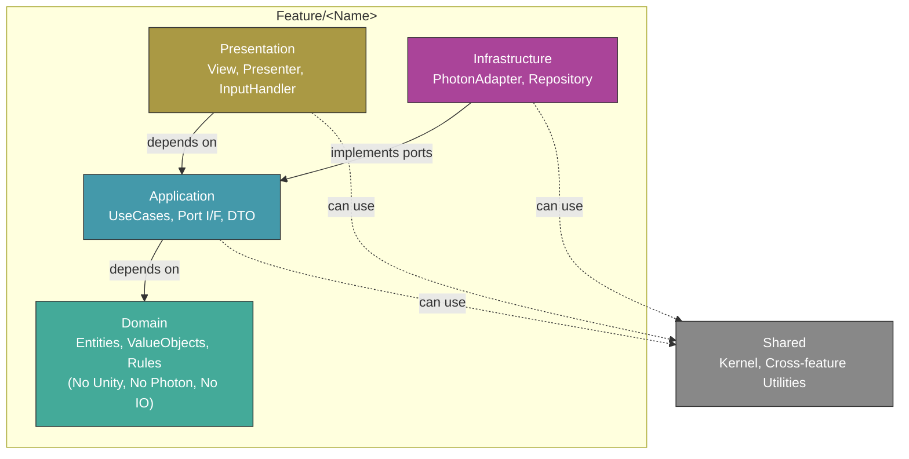
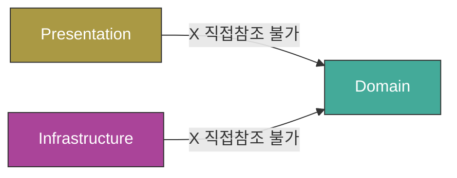

# Architecture Diagram

## asmdef 제약

> Presentation / Infrastructure는 Domain을 직접 참조할 수 없음
> 따라서 `LobbyTeam` 같은 enum은 Application DTO로 유지

## 의존성 방향 요약

| From | To | 비고 |
|---|---|---|
| **Presentation** | Application, Shared | Domain 직접 참조 불가 |
| **Infrastructure** | Application, Shared | Domain 직접 참조 불가 |
| **Application** | Domain, Shared | |
| **Domain** | (없음) | 순수 비즈니스 로직만 |
| **Shared** | (없음) | Feature 코드 의존 금지 |
