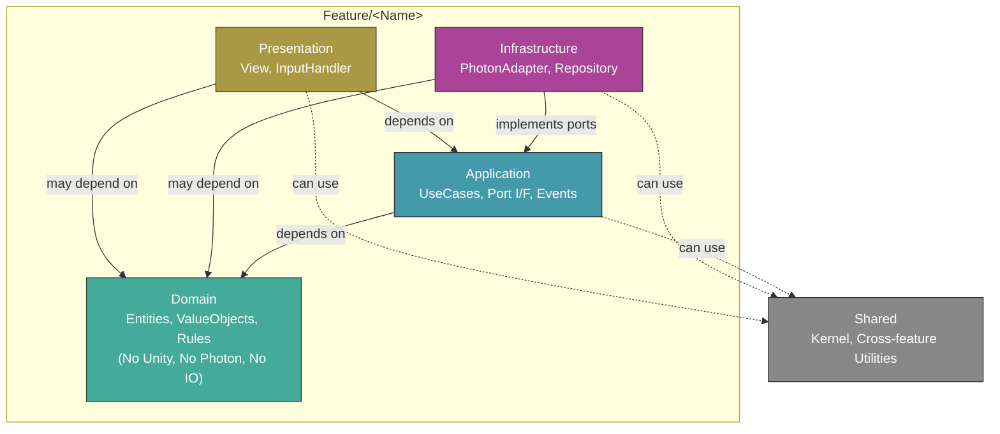

# Architecture Diagram

구조·의존·레이어의 **단일 기준**은 [`/agent/architecture.md`](../agent/architecture.md)이다. 이 파일은 그림으로만 요약한다.

## 어셈블리(asmdef)

현재 `Assets/Scripts/Features/**` 쪽 **프로젝트 코드에는 피처별 `asmdef`가 없다.** 레이어 준수는 폴더·리뷰·규칙 문서로 유지한다.

나중에 `asmdef`로 어셈블리를 쪼개면, 그때 **허용 참조 테이블**을 이 문서와 `architecture.md`에 같이 갱신한다. (쪼갠 뒤에는 Presentation 어셈블리가 Domain 어셈블리를 참조하지 않게 만드는 선택도 가능하다.)

## 타입 배치 힌트

UI가 **도메인 타입에 직접 묶이지 않게** 하려면, 이벤트 페이로드·화면 전용 DTO를 Application 쪽에 두는 패턴을 쓸 수 있다. (예: 로비 팀 표시용 값은 View가 아닌 이벤트/포트 경유.)

## 의존성 방향 요약

`architecture.md`의 Dependency direction·Layer rules와 동일:

| From | To | 비고 |
|---|---|---|
| **Presentation** | Application, Domain, Shared, 다른 피처의 same-or-inner | 비즈니스 로직은 View에 두지 않는다 (`architecture.md` Layer rules) |
| **Infrastructure** | Application, Domain, Shared, 다른 피처의 same-or-inner | 포트 구현·외부 SDK |
| **Application** | Domain, Shared, 다른 피처의 Application 또는 Domain | Unity/Photon API 금지 (`architecture.md`) |
| **Domain** | (없음) | 순수 비즈니스 로직만 |
| **Shared** | (없음) | 피처 코드 의존 금지 |

피처 **간** 의존은 같은 레이어 방향만 지키면 허용된다 (`architecture.md` 본문 참고).
