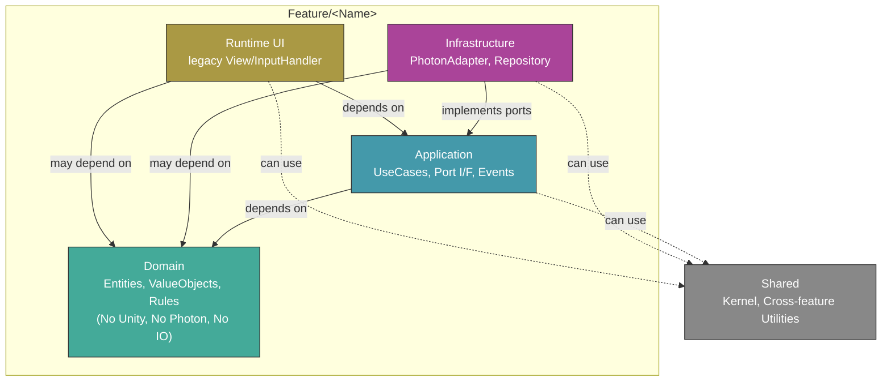

# Architecture Diagram

> 마지막 업데이트: 2026-04-27
> 상태: reference
> doc_id: design.architecture-diagram
> role: reference
> owner_scope: 포트 소유권과 런타임 구조의 시각 요약
> upstream: docs.index
> artifacts: none

구조·의존의 **단일 기준**은 현재 owner 문서 기준으로 해석하며, 경로는 [AGENTS.md](../../AGENTS.md)와 [docs/index.md](../index.md)에서 찾는다. 새 UX/UI 개발은 Stitch source freeze와 UI Toolkit candidate surface를 기준으로 한다.

## 포트 소유권 패턴

크로스 피처 포트는 **Consumer-Driven Contract** 패턴을 따른다:

| 항목 | 위치 | 규칙 |
|---|---|---|
| **포트 인터페이스** | `Consumer/Application/Ports/` | 사용하는 쪽(Consumer)에서 정의 |
| **포트 구현** | `Provider/Infrastructure/` | 제공하는 쪽(Provider)에서 구현 |

셀프 피처 포트는 동일 피처 내에서 정의·구현한다.

## 피처 간 의존성 그래프

피처 간 dependency graph는 이 문서에서 수동으로 유지하지 않는다.

* 현재 그래프는 `Temp/LayerDependencyValidator/feature-dependencies.json` generated artifact를 본다.
* feature root의 composition code(`*Setup`, `*Bootstrap`, scene root)는 그래프에서 제외하고, 레이어 내부 코드만 DAG 품질 게이트에 반영한다.
* `Application/Ports` 참조는 승인된 DIP seam으로 보고 edge에서 제외한다.
* analytics/reporting 전용 observer 코드는 gameplay DAG 품질 게이트에서 제외한다.
* 품질 게이트는 “새 의존성 금지”가 아니라 “cycle 금지”다.
* 즉 `A -> B`는 허용하지만 `A -> B -> A`, `A -> B -> C -> A`는 구조 위반이다.

## 어셈블리(asmdef)

현재 `Assets/Scripts/Features/**` 쪽 **프로젝트 코드에는 피처별 `asmdef`가 없다.** 레이어 준수는 폴더·리뷰·규칙 문서로 유지한다.

나중에 `asmdef`로 어셈블리를 쪼개면, 그때 **허용 참조 테이블**을 이 문서와 현재 architecture owner 문서에 같이 갱신한다.

## 타입 배치 힌트

UI가 **도메인 타입에 직접 묶이지 않게** 하려면, 이벤트 페이로드·화면 전용 DTO를 Application 쪽에 두는 패턴을 쓸 수 있다. (예: 로비 팀 표시용 값은 View가 아닌 이벤트/포트 경유.)

## 의존성 방향 요약

현재 architecture owner 문서의 Dependency direction·Layer rules와 동일:

| From | To | 비고 |
|---|---|---|
| **Runtime UI** | Application, Domain, Shared | legacy scene/prefab compatibility. 새 UX/UI는 UI Toolkit candidate surface에서 시작한다 |
| **Infrastructure** | Application, Domain, Shared, 다른 피처의 same-or-inner | 포트 구현·외부 SDK |
| **Application** | Domain, Shared, 다른 피처의 Application 또는 Domain | Unity/Photon API 금지 (현재 architecture owner 문서) |
| **Domain** | (없음) | 순수 비즈니스 로직만 |
| **Shared** | (없음) | 피처 코드 의존 금지 |

피처 **간** 의존은 cycle 금지와 owner boundary를 기준으로 판단한다.
