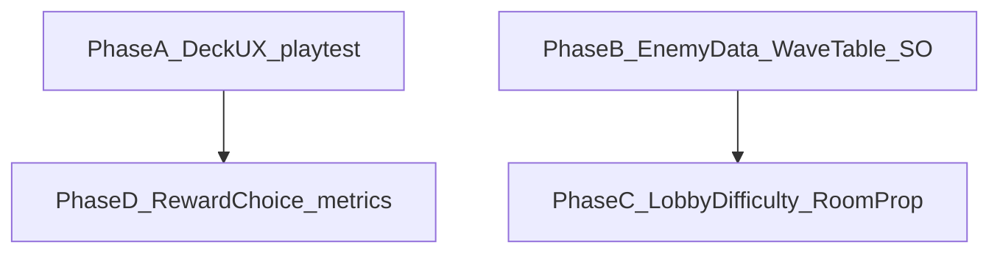

# MVP 재미 검증 — 구현 계획 (실행 분해)

페르소나 토의 샘플 합의([discussion_game_fun_personas.md](../discussions/discussion_game_fun_personas.md) `## 샘플 토의 전문`)와 [game_design.md](../design/game_design.md) §「MVP 검증 포인트」「이번 분기 측정 정의」를 **구현·데이터·플레이테스트 작업**으로 나눈 문서다.

## SSOT 위임 (필수)

| 주제 | 단일 근거 |
|------|-----------|
| 수치·통과 기준·MVP 문장·웨이브 시간표 | [game_design.md](../design/game_design.md) 만 수정 |
| 재미 워크숍·페르소나·토의 기록 | [discussion_game_fun_personas.md](../discussions/discussion_game_fun_personas.md) |
| 플레이 세션 노트 양식 | [playtest_mvp_template.md](../playtest/playtest_mvp_template.md) |
| Room/Player CustomProperties 키 소유권 | [state_ownership.md](../../agent/state_ownership.md) — **새 키 추가 시 반드시 갱신** |
| 스킬 분류 태그와 현재 코드 매핑 | [Skill README](../../Assets/Scripts/Features/Skill/README.md) — 수치·MVP 정의는 `game_design.md`만 SSOT |

본 파일은 **무엇을 어느 순서로 손대는지**만 적는다. 결정이 바뀌면 위 SSOT를 먼저 고친 뒤 여기 체크리스트를 맞춘다.

**프로젝트 규칙:** [CLAUDE.md](../../CLAUDE.md)의 필수 워크플로를 시작점으로 삼고, 상세 판단은 [anti_patterns.md](../../agent/anti_patterns.md), [architecture.md](../../agent/architecture.md), [state_ownership.md](../../agent/state_ownership.md)를 따른다.

---

## SSOT·anti_patterns 정합성 검증

아래는 **본 계획을 그대로 구현할 때** 지켜야 할 대응 관계다. 충돌이 없도록 설계했다.

| 규칙 출처 | 요구 | 본 계획과의 관계 |
|-----------|------|------------------|
| state_ownership — 동기화 채널 | 방 단위 **상태**는 `CustomProperties` | 난이도 프리셋은 **Room CustomProperties**로만 동기화. RPC 전용으로 두지 않는다. |
| architecture / anti_patterns — Network 피처 | CommandPort / CallbackPort, Adapter 구현 | Lobby: 기존 `LobbyPhotonAdapter` 패턴에 **방 속성 병합(SetCustomProperties)** 추가. Wave가 값을 **읽기만** 하면 Wave 쪽은 기존 `WaveNetworkAdapter`와 동일하게 **인프라에서 Room 읽기** 가능; **쓰기는 Lobby만** ([state_ownership.md](../../agent/state_ownership.md)). |
| anti_patterns — View | View/InputHandler에 비즈니스·네트워크 로직 금지 | 난이도 UI는 **입력만** → `LobbyUseCases` → Adapter. `LobbyView`에서 직접 `PhotonNetwork` 호출 금지. |
| anti_patterns — Domain | Domain에 네트워킹·Unity API 금지 | 프리셋 ID→배율 매핑은 **Wave.Application** 등 순수 C#에 둔다(아래 Phase C). |
| anti_patterns — Bootstrap | 비즈니스 분기·게임 규칙 장문 금지 | `WaveBootstrap`은 **주입·구독·Initialize 호출만**. 스폰 개수 배율 계산은 **Application 정적 매핑 또는 소형 유스케이스**로 분리. |
| anti_patterns — Dual state | 동일 개념 이중 소유 금지 | 난이도의 근원은 **Room CP 한 곳**. Wave에 별도 “난이도 도메인 엔티티”를 두지 않고, 스폰 시점에 **읽기·적용**만 한다. |
| anti_patterns — GetComponent | 의존성은 `[Required, SerializeField]` | 새 어댑터·뷰 참조는 **씬/프리팹 배선**으로만. Photon Instantiate 예외는 기존 Enemy 경로 README대로. |
| anti_patterns — Port 위치 | Unity 타입 없는 포트만 Application/Ports | 배율 조회가 `float`/`int`만 쓰면 `Features/Wave/Application/Ports`에 `IDifficultySpawnScale` 같은 **읽기 전용 포트** 가능. Unity 의존 시 Presentation으로. |
| CLAUDE 워크플로 | `Features/<Name>/README.md` 갱신 | Phase C 이후 **Lobby·Wave README**에 Room 키, 읽기 시점, late-join 시 난이도 반영 여부 명시. |

**키 문자열:** `difficultyPreset`(가칭) 값은 [state_ownership.md](../../agent/state_ownership.md)에 한 줄로 고정하고, Lobby 상수(`LobbyPhotonConstants`)와 Wave 인프라의 읽기 키가 **동일 문자열**이어야 한다. Wave가 Lobby 어셈블리를 참조하지 않도록, **문자열은 양쪽 각각 상수로 두고 SSOT 문서로 동기화**하거나, 아키텍처상 허용 시 **공유 최소 상수** 한 파일로만 맞춘다(새 공유 파일 추가 시 [architecture.md](../../agent/architecture.md)와 팀 합의).

### 구현 반영 후 anti_patterns 재점검 요약

| 항목 | 판단 |
|------|------|
| View에 네트워크/도메인 규칙 | 로비 뷰는 입력·표시만; Photon은 `LobbyUseCases`→Adapter. `BarView`에서 **Debug.Log 제거**([anti_patterns.md](../../agent/anti_patterns.md) 로깅 위치 권장에 맞춤). |
| `GetComponent` | `EnemySetup`이 **같은 GameObject**의 `PhotonView`로 `InstantiationData` 읽기 → anti_patterns **예외(한 번·로컬·문서화)**. [Enemy/README.md](../../Assets/Scripts/Features/Enemy/README.md)에 예외 한 줄 명시. |
| Bootstrap | `WaveBootstrap`은 `ResolveSpawnCountMultiplier()`로 배율만 조회해 `EnemySpawnAdapter`에 **주입**; 매핑은 `DifficultySpawnScale`(Application). 선택 `RoomDifficultySpawnScaleProvider`(`IDifficultySpawnScale`) 연결 시 조회 경로를 한 컴포넌트로 모음(미연결 시 Reader+Scale 폴백). |
| Dual state | 난이도는 Room CP 단일 근원; Wave는 런타임 복제 엔티티로 보관하지 않음. |
| `DifficultySpawnScale`의 `int` 기본값 | 네트워크에서 온 int에 대한 `_ => 1f`는 **enum silent default 금지** 규칙과 별개(검증은 Lobby 도메인 `ValidateDifficultyPreset`). |
| Unity 생성 `Assembly-CSharp.csproj` | 새 스크립트가 `<Compile>` 목록에 없으면 IDE/`dotnet build`가 타입을 못 찾음. **에디터에서 프로젝트 파일 재생성**하거나, 목록에 수동 추가(재생성 시 덮어쓸 수 있음). |

---

## 배경·우선순위

1. **① 덱 순환 직관** — 플레이테스트로 검증을 최우선. 코드는 기존 구현 점검·소폭 폴리시 위주.
2. **② (병행)** 적 최소 변종 + 웨이브 `ScriptableObject` 정렬 — **데이터 중심**; 스폰 파이프라인은 이미 `EnemyData`를 받는다.
3. **③** 로비 난이도 — Room 속성 + 인게임 배율 + **한 줄 표시**; HUD·피킹 부담 키우지 않기.
4. **② 측정(새 스킬 vs 강화)** — `[MvpReward]` 로그·관찰로 [game_design.md](../design/game_design.md) 절차 수행.

**프렌들리 파이어·4인 밀도:** 정식 지표 밖. 질적 메모만 ([game_design.md](../design/game_design.md) 참고).

---

## 페이즈 의존 관계

- **D**는 **A**와 병행 가능(보상 UI·로그는 이미 존재).
- **C**는 **B** 이후를 권장(적 밀도·스폰 배율 튜닝과 난이도 배율을 한 번에 디버깅하기 쉬움).

---

## Phase A — ① 덱 순환 직관 (검증 준비·보강)

**목표:** [game_design.md](../design/game_design.md) 측정을 수행할 수 있는 상태인지 확인한다.

### 코드·씬 (구체)

- [ ] [DeckCycleHandler.cs](../../Assets/Scripts/Features/Skill/Application/DeckCycleHandler.cs): `DeckNextDrawPreviewEvent` 발행 시점(시전 후·초기화)이 README와 일치하는지 확인.
- [ ] [BarView.cs](../../Assets/Scripts/Features/Skill/Presentation/UI/BarView.cs): `OnEnable`/이벤트 구독에서 아이콘·라벨 갱신 로직이 null 안전한지 확인. 변경 시 **Presentation만** — Application에 `Sprite`/`Color` 이외 포트 추가 금지([anti_patterns.md](../../agent/anti_patterns.md) 포트 배치).
- [ ] 게임 씬에서 스킬 바가 붙은 프리팹/오브젝트: Inspector에서 `nextDrawPreviewIcon`, `nextDrawHintLabel` **SerializeField 연결**.
- [ ] (선택) `firstWaveDeckHintText` 등 Wave HUD 힌트는 [Wave/README.md](../../Assets/Scripts/Features/Wave/README.md)에 따름 — 덱 규칙 **장문 설명**을 전투 중에 늘리지 않기(페르소나 C와 충돌 방지).

### 체크리스트 (구현/에디터)

- [ ] [Skill/README.md](../../Assets/Scripts/Features/Skill/README.md): 덱 다음 장 미리보기 — `DeckNextDrawPreviewEvent`, `BarView`의 `nextDrawPreviewIcon` / `nextDrawHintLabel`.
- [ ] 씬·프리팹에서 위 필드가 **연결되어 있는지** Inspector로 확인 ([BarView.cs](../../Assets/Scripts/Features/Skill/Presentation/UI/BarView.cs)).
- [ ] 미연결이면 연결하거나, 측정을 **인터뷰만**으로 할지 `../design/game_design.md` 측정 정의와 맞게 기록.

**코드 변경 원칙:** 기능 스코프 확장 금지. 가독성·버그 수정 수준의 소폭 수정만. 필요 시 Skill Presentation 계층만.

### 플레이테스트 세션 (절차 요약)

1. 대상: 덱 규칙을 **사전에 길게 설명하지 않은** 플레이어.
2. 시점: **웨이브 2 클리어 직전** — “RMB/Q에 무엇이 있고, 시전 후 다음 스킬이 무엇인지” 말로 설명 요청.
3. 통과 후보·HUD 활용: `game_design.md` 282–283행 준수.
4. 결과는 [playtest_mvp_template.md](../playtest/playtest_mvp_template.md)에 남긴다.

---

## Phase B — 적 콘텐츠 믹스 (데이터 우선)

**목표:** 동일 AI라도 **스탯만 다른 `EnemyData` 2종 이상** + 웨이브 테이블에서 혼합 스폰으로 포지셔닝 압박을 `game_design.md` 웨이브 목적에 더 가깝게 만든다.

### 데이터 작업

- [ ] [BasicEnemy.asset](../../Assets/Resources/Enemy/BasicEnemy.asset)을 복제하거나 신규 SO로 **변종 1개 이상** 추가 (이동 속도·HP 등만 차이 — 샘플 토의와 동일).
- [ ] [DefaultWaveTable.asset](../../Assets/Resources/Wave/DefaultWaveTable.asset): `WaveTableData`의 `waves` 배열을 [game_design.md](../design/game_design.md) **5웨이브·시간 배분**에 맞게 확장하는 것을 목표로 엔트리 추가·`enemyData`·`count`·`spawnRadius` 등 조정 (구체 수치는 SSOT 문서와 에디터에서 확정).

### 코드 (SO만으로 부족할 때만)

- [ ] [EnemySpawnAdapter.cs](../../Assets/Scripts/Features/Wave/Infrastructure/EnemySpawnAdapter.cs): `SpawnWaveEnemiesCoroutine`이 `entry.Count`·`entry.EnemyData`만 사용 — **변종 혼합은 웨이브 테이블 SO만으로 가능**.
- [ ] **스폰 개수 배율**(Phase C와 연동 시): `entry.Count * multiplier` 산식은 **Wave.Application** 순수 함수(예: `SpawnCountScaling.Apply(int baseCount, float multiplier)`)로 두고, Adapter는 결과만 사용 — **WaveBootstrap에 산식·분기 금지**([anti_patterns.md](../../agent/anti_patterns.md) Bootstrap).
- [ ] 행동 패턴 변경 시: [EnemyAiAdapter.cs](../../Assets/Scripts/Features/Enemy/Infrastructure/EnemyAiAdapter.cs) 또는 `EnemyData` 확장 + Factory/Strategy — `EnemySetup`·Master 전용 AI 초기화 순서는 [Enemy/README.md](../../Assets/Scripts/Features/Enemy/README.md) 유지.

---

## Phase C — 로비 난이도·표시 (코드 단계)

**목표:** Room에 **프리셋 ID**(또는 동등한 정수) 동기화 → 게임 씬에서 **한 번 해석**해 스폰 배율 등에 반영 → 로비 UI는 **한 줄 + 최소 컨트롤**.

### C-1. 계약

- [ ] [state_ownership.md](../../agent/state_ownership.md): Room 행에 키·소유(Lobby)·용도·쓰기 위치 표 추가.
- [ ] [LobbyPhotonConstants.cs](../../Assets/Scripts/Features/Lobby/Infrastructure/Photon/LobbyPhotonConstants.cs): 키 상수(문자열) 추가.
- [ ] Wave 읽기: `Features/Wave/Infrastructure`에 **키 문자열 상수** 별도 선언 — 주석으로 `state_ownership`과 동일해야 함을 명시(Wave→Lobby 프로젝트 참조 추가는 피함).

### C-2. Lobby — 쓰기 (CustomProperties만)

- [ ] [Room.cs](../../Assets/Scripts/Features/Lobby/Domain/Room/Room.cs)(및 필요 시 `LobbyRule`): 프리셋 필드·검증(방장만 변경, 게임 시작 후 변경 불가 등) — **Photon 호출 없음**.
- [ ] [LobbyUseCases.cs](../../Assets/Scripts/Features/Lobby/Application/LobbyUseCases.cs): `CreateRoom` 시그니처 확장 또는 후속 `SetDifficulty` 유스케이스 — **검증 후** 네트워크 포트 호출.
- [ ] [LobbyPhotonAdapter.cs](../../Assets/Scripts/Features/Lobby/Infrastructure/Photon/LobbyPhotonAdapter.cs): `CreateRoom`의 `CustomRoomProperties`에 프리셋 병합; 변경 시 `room.SetCustomProperties` **부분 갱신** 패턴은 기존 팀/레디 갱신과 동일하게 유지.
- [ ] 방 목록에 키 노출이 필요하면 `CustomRoomPropertiesForLobby` 배열에 동일 키 추가(Photon 문서와 동일 동작 확인).

### C-3. Lobby — UI

- [ ] [RoomListView.cs](../../Assets/Scripts/Features/Lobby/Presentation/RoomListView.cs) / [RoomDetailView.cs](../../Assets/Scripts/Features/Lobby/Presentation/RoomDetailView.cs) 등: 드롭다운·버튼은 **이벤트 → UseCases**만. `PhotonNetwork` 직접 호출 금지.
- [ ] 방 제목 옆·디테일 패널에 **한 줄 라벨**(예: “난이도: 보통”) — 표시 문자열은 Presentation 또는 소형 Presenter에서 도메인 enum→문자 매핑.

### C-4. Wave — 읽기·배율 (게임 씬)

- [ ] **프리셋→배율:** `Features/Wave/Application`에 정수 프리셋 ID → `float` 배율(들) 순수 매핑. 수치는 `../design/game_design.md` 확정 후 코드/상수에 반영.
- [ ] **읽기 시점:** [WaveBootstrap.Initialize](../../Assets/Scripts/Features/Wave/WaveBootstrap.cs)에서 `_spawnAdapter.Initialize(...)` **이전**에 Room에서 프리셋 읽기 → 배율을 `EnemySpawnAdapter.Initialize`에 인자로 전달하거나, `IWaveSpawnPort` 구현체에 주입. **late-join:** [WaveNetworkAdapter.HydrateFromRoomProperties](../../Assets/Scripts/Features/Wave/Infrastructure/WaveNetworkAdapter.cs)와 같은 패턴으로 “이미 방에 들어온 클라이언트”가 프리셋을 놓치지 않는지 README에 명시(난이도는 웨이브 진행 중 변경 안 함이 기본).
- [ ] [EnemySpawnAdapter.cs](../../Assets/Scripts/Features/Wave/Infrastructure/EnemySpawnAdapter.cs): 코루틴에서 스폰 루프 횟수에만 배율 적용할지, `EnemyData` 스펙 복제 후 HP에 곱할지는 **game_design**과 맞추고, **도메인 엔티티 생성 규칙**은 기존 `SpawnEnemyUseCase` 경로 존중.

### C-5. 검증 (아키텍처 스모크)

- [ ] Lobby Application/Domain에 `UnityEngine` 타입 없음.
- [ ] Wave Application의 포트/유스케이스에 `UnityEngine` 없음([anti_patterns.md](../../agent/anti_patterns.md) Application).
- [ ] `[MvpReward]`·보상 로직(Phase D)에 손대지 않음 — 난이도는 스폰/스펙 경로만.

---

## Phase D — ② 새 스킬 vs 강화 (측정)

**목표:** [game_design.md](../design/game_design.md) 측정 A/B 수행.

### 구현 상태 (레포)

- **에디터·Development 빌드**에서 `[MvpReward]` 로그가 이미 남는다: [WaveFlowController.cs](../../Assets/Scripts/Features/Wave/Presentation/WaveFlowController.cs), [UpgradeSelectionView.cs](../../Assets/Scripts/Features/Wave/Presentation/UpgradeSelectionView.cs). 상세는 [Wave/README.md](../../Assets/Scripts/Features/Wave/README.md).

### 코드·빌드 (구체)

- [ ] 로그는 기존처럼 **`UNITY_EDITOR` 또는 `DEVELOPMENT_BUILD`** 안에서만 활성([WaveFlowController.cs](../../Assets/Scripts/Features/Wave/Presentation/WaveFlowController.cs) 등과 동일). 릴리스 빌드에 `[MvpReward]` 문자열·PII 노출 추가 금지.
- [ ] 측정용 필드가 View에 생기면 **표시만** — 집계·판정 로직은 View 밖.

### 체크리스트

- [ ] Development 빌드에서 후보 순서·수동/자동 선택 로그 캡처 가능한지 확인.
- [ ] 관찰 A(10초 내 망설임·버튼 변경), 사후 B(설문/택일)를 [playtest_mvp_template.md](../playtest/playtest_mvp_template.md)에 맞춰 기록.
- [ ] 통과 임계값을 바꿀 때는 **`../design/game_design.md`만** 수정.

---

## 피처 README 갱신 (필수 워크플로)

코드·씬을 건드린 피처마다 해당 `README.md`를 갱신한다.

| 피처 | 트리거 예시 |
|------|-------------|
| [Skill](../../Assets/Scripts/Features/Skill/README.md) | BarView·덱 미리보기 연결·UI 수정 시 |
| [Wave](../../Assets/Scripts/Features/Wave/README.md) | 스폰 배율·난이도 읽기·Bootstrap 시 |
| [Lobby](../../Assets/Scripts/Features/Lobby/README.md) | Room 속성·로비 UI·난이도 선택 시 |
| [Enemy](../../Assets/Scripts/Features/Enemy/README.md) | AI·스펙 파이프라인 변경 시 |

---

## 완료 정의 (이 계획이 “끝났다”고 말하려면)

- [ ] `../design/game_design.md` **①** 측정을 1회 이상 수행하고, 결과를 토의 메모 또는 플레이테스트 템플릿에 남김.
- [ ] `EnemyData` **2종 이상** + 웨이브 테이블이 디자인 방향(예: 5웨이브)에 **데이터상** 정렬.
- [ ] 로비 난이도: Room 동기화 + 인게임 배율 + 로비 **한 줄(또는 동등)** 표시.
- [ ] `state_ownership.md`에 새 Room 키 반영.
- [ ] 변경한 피처 README 정리.

---

## 하지 않을 것

- `../design/game_design.md` 수치·문장을 본 문서만 보고 임의 변경하지 않는다. 반영은 SSOT에서 확정 후.
- Phase 2(시너지·메타·런 연장 등)는 [game_design.md](../design/game_design.md) Phase 2 절 범위 밖에서 확장하지 않는다.
- [state_ownership.md](../../agent/state_ownership.md)와 네트워크 규칙에 어긋나는 동기화 경로 사용: `PhotonTransformView` 등 **CustomProperties / RPC / SerializeView** 밖 채널로 난이도만 동기화하지 않는다.
- 난이도를 **이중 저장**(예: Room CP + 별도 정적 싱글톤)하지 않는다 — **Room CP 단일 근원**.
